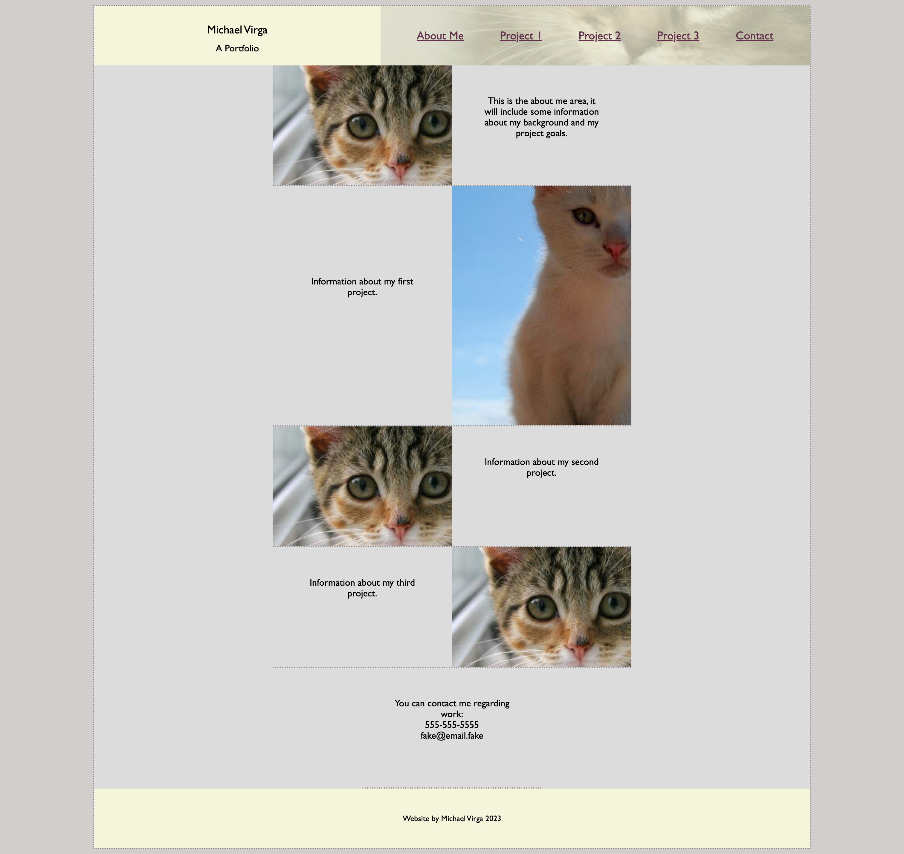

# Michael Virga Portfolio
### A personal website

This repository is for my personal website that will showcase my projects created during the UC Berkeley Coding Bootcamp.

For this project, I've improved and commented the code for a fictional company's website.

The website is live on github pages [and can be viewed here.](https://studiomav.github.io/horiseon_website/Develop/)

If all is well, the page should display like in this screenshot:

There is no license for this project and it is intended for educational purposes only.